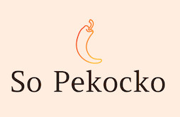
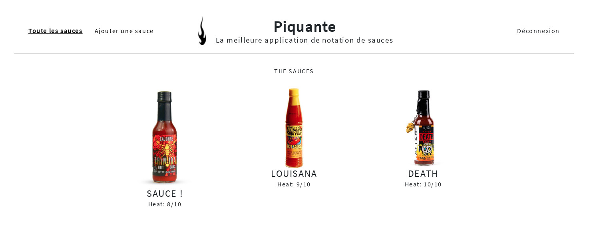

<!--
*** Thanks for checking out the Best-README-Template. If you have a suggestion
*** that would make this better, please fork the repo and create a pull request
*** or simply open an issue with the tag "enhancement".
*** Thanks again! Now go create something AMAZING! :D
-->


<!-- PROJECT SHIELDS -->
<!--
*** I'm using markdown "reference style" links for readability.
*** Reference links are enclosed in brackets [ ] instead of parentheses ( ).
*** See the bottom of this document for the declaration of the reference variables
*** for contributors-url, forks-url, etc. This is an optional, concise syntax you may use.
*** https://www.markdownguide.org/basic-syntax/#reference-style-links
-->


<!-- PROJECT LOGO -->
<br />
<p align="center">
  <a href="https://github.com/othneildrew/Best-README-Template">
    
  </a>

  <h3 align="center">So Pekocko</h3>

  <p align="center">
    Projet 6 - Parcours Développeur WEB - OpenClassRooms
</p>


<!-- TABLE OF CONTENTS -->
<details open="open">
  <summary>Table des matières</summary>
  <ol>
    <li>
      <a href="#a-propos-du-projet">A propos de ce projet</a>
      <ul>
        <li><a href="#built-with">Built With</a></li>
      </ul>
    </li>
    <li>
      <a href="#getting-started">Getting Started</a>
      <ul>
        <li><a href="#prerequisites">Prérequis</a></li>
        <li><a href="#installation">Installation</a></li>
      </ul>
    </li>
    <li><a href="#usage">Usage</a></li>
    <li><a href="#roadmap">Roadmap</a></li>
    <li><a href="#contribution">Contribution</a></li>
    <li><a href="#licence">Licence</a></li>
    <li><a href="#contact">Contact</a></li>
  </ol>
</details>


<!-- ABOUT THE PROJECT -->
## A propos du projet



Ceci est la partie frontend du site So Pekocko.
C'est une application d’évaluation de ses sauces piquantes, appelée “Piquante”.
Même si l’application deviendra peut-être un magasin en ligne dans un futur proche, il permet aux utilisateurs d’ajouter leurs sauces préférées et de liker ou disliker les sauces ajoutées par les autres utilisateurs.


### Built With

Le backend utilise: 
* [nodejs](https://nodejs.org)
* [expressjs](https://expressjs.com)

<!-- GETTING STARTED -->
## Getting Started

Pour obtenir une copie locale opérationnelle, suivez ces étapes:

### Prerequisites

Vous devez avoir npm d'installé sur votre système.
[npm](https://www.npmjs.com/get-npm)


### Installation

1. Clone the repo
   ```sh
   https://github.com/oliv134/p6.git
   ```
2. Install NPM packages
   ```sh
   npm install
   ```


<!-- USAGE EXAMPLES -->
## Usage

Le frontend est disponible ici: [https://github.com/OpenClassrooms-Student-Center/dwj-projet6](https://github.com/OpenClassrooms-Student-Center/JWDP5.git).

Vous devez installer node-sass 4.14.1.

Il est accessible via [http://localhost:4200/](http://localhost:4200/)

#### Start
Pour ce projet, vous excutez le backend via:
   ```sh
   npm start
   ```
Le backend s'exécute.

Le schéma du mot de passe est:

* Minimum length 8,
* Maximum length 100,
* Must have uppercase letters,
* Must have lowercase letters,
* Must have at least 2 digits,
* Should not have spaces,
* 'Passw0rd', 'Password123', 'qwertyuiop', 'qwerty', 'azertyuiop', 'azerty' are Blacklisted.


<!-- ROADMAP -->
## Roadmap

Voir les [issues](https://github.com/oliv134/p6/issues) pour une liste des fonctionnalités proposées (et des problèmes connus).


<!-- CONTRIBUTING -->
## Contribution

Les contributions sont ce qui fait de la communauté open source un endroit incroyable pour apprendre, inspirer et créer. Toute contribution que vous apportez est ** grandement appréciée **.

1. Fork the Project
2. Create your Feature Branch (`git checkout -b feature/AmazingFeature`)
3. Commit your Changes (`git commit -m 'Add some AmazingFeature'`)
4. Push to the Branch (`git push origin feature/AmazingFeature`)
5. Open a Pull Request


<!-- LICENSE -->
## Licence

Distribué sous la licence MIT. Voir `LICENCE` pour plus d'informations.


<!-- CONTACT -->
## Contact

Olivier Poteau - [@oliv134](https://twitter.com/Oliv134/) - oliv134@oliv134.net

Dépot du projet: [https://github.com/oliv134/p6](https://github.com/oliv134/p6)

<!-- MARKDOWN LINKS & IMAGES -->
<!-- https://www.markdownguide.org/basic-syntax/#reference-style-links -->
[contributors-shield]: https://img.shields.io/github/contributors/othneildrew/Best-README-Template.svg?style=for-the-badge
[contributors-url]: https://github.com/othneildrew/Best-README-Template/graphs/contributors
[forks-shield]: https://img.shields.io/github/forks/othneildrew/Best-README-Template.svg?style=for-the-badge
[forks-url]: https://github.com/othneildrew/Best-README-Template/network/members
[stars-shield]: https://img.shields.io/github/stars/othneildrew/Best-README-Template.svg?style=for-the-badge
[stars-url]: https://github.com/othneildrew/Best-README-Template/stargazers
[issues-shield]: https://img.shields.io/github/issues/othneildrew/Best-README-Template.svg?style=for-the-badge
[issues-url]: https://github.com/othneildrew/Best-README-Template/issues
[license-shield]: https://img.shields.io/github/license/othneildrew/Best-README-Template.svg?style=for-the-badge
[license-url]: https://github.com/othneildrew/Best-README-Template/blob/master/LICENSE.txt
[linkedin-shield]: https://img.shields.io/badge/-LinkedIn-black.svg?style=for-the-badge&logo=linkedin&colorB=555
[linkedin-url]: https://linkedin.com/in/othneildrew
[product-screenshot]: images/screenshot.png